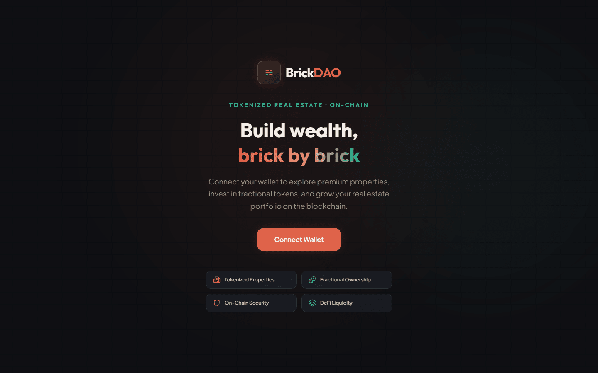
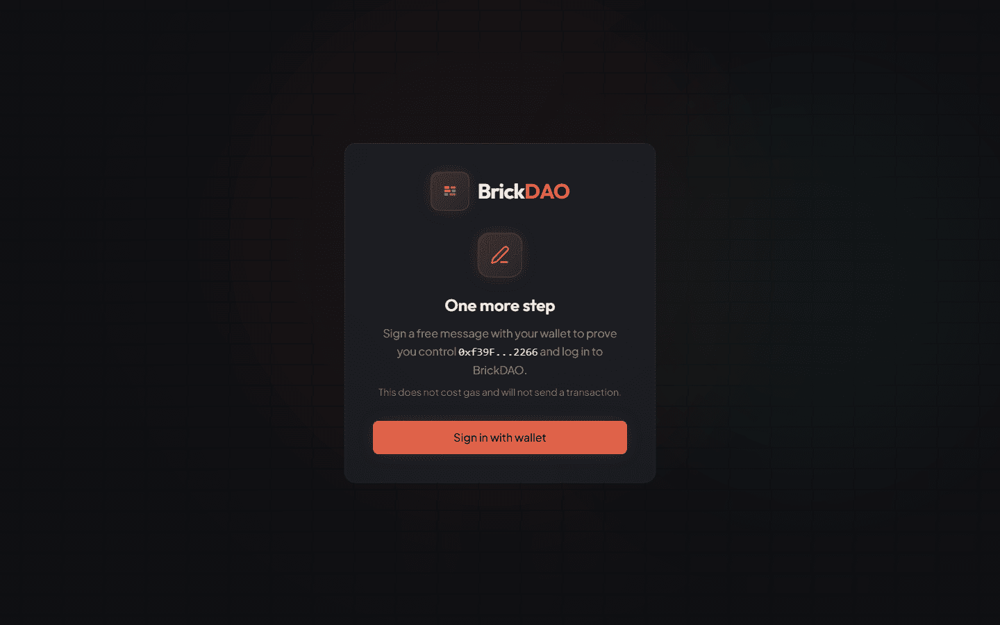
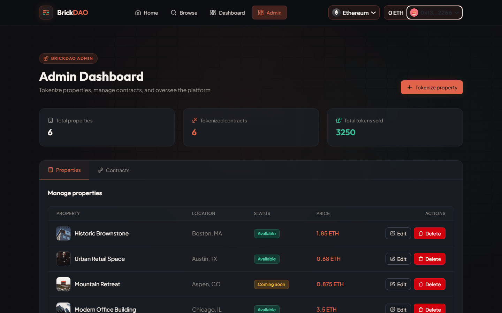
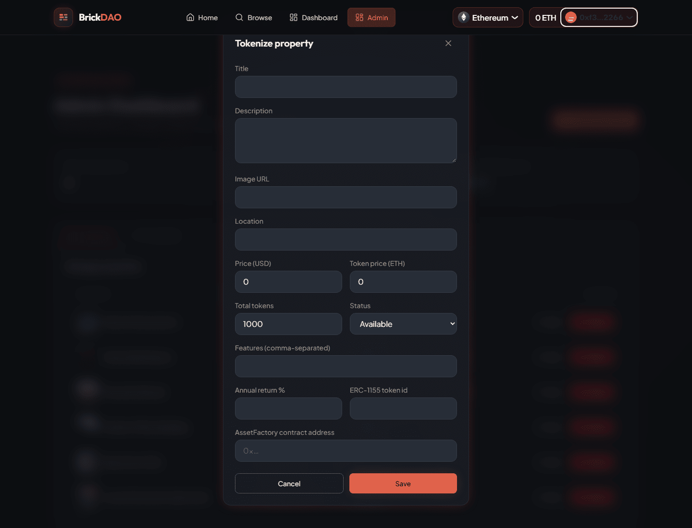
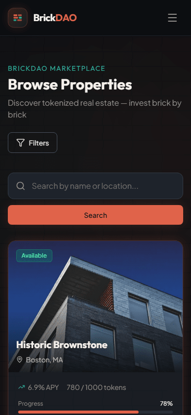

# BrickDAO

Tokenized real estate investment platform. Properties are represented as ERC-1155 tokens on an AssetFactory smart contract, listed and managed through a NestJS API, and bought from a Next.js app with a browser wallet.

## Overview

BrickDAO lets investors buy fractional ownership of properties. Each property maps to one ERC-1155 token id inside a shared `AssetFactory` contract. Users sign in with their wallet (no passwords), browse listings that come from the API, and purchase tokens with an on-chain transaction that is then recorded against their portfolio. Admins manage listings from a role-protected panel.

The repository is a monorepo of three independent npm projects:

| Folder | What it is | Stack |
| --- | --- | --- |
| [`contracts/`](./contracts) | `AssetFactory` ERC-1155 contract, tests and deployment module | Hardhat 3, viem, OpenZeppelin 5, Solidity 0.8.24 |
| [`backend/`](./backend) | REST API: wallet sign-in, properties, portfolio | NestJS 11, Prisma 6, PostgreSQL, Swagger |
| [`frontend/`](./frontend) | Web app: browse, property pages, purchase flow, dashboard, admin | Next.js 16, React 19, RainbowKit, wagmi, TanStack Query, Tailwind CSS 4 |

## Screenshots

<table>
  <tr>
    <td width="50%"><br><sub><b>Landing.</b> Shown until a wallet is connected.</sub></td>
    <td width="50%"><br><sub><b>Sign-in.</b> The connected wallet signs a single-use message; no gas, no transaction.</sub></td>
  </tr>
  <tr>
    <td width="50%"><br><sub><b>Browse.</b> Listings, search and filters served by the API.</sub></td>
    <td width="50%"><br><sub><b>Property detail.</b> Funding progress, token price and the on-chain contract address.</sub></td>
  </tr>
  <tr>
    <td width="50%"><br><sub><b>Purchase.</b> Choose a token amount; the total is price times amount.</sub></td>
    <td width="50%"><br><sub><b>Dashboard.</b> Portfolio, transactions and settings for the signed-in wallet.</sub></td>
  </tr>
  <tr>
    <td width="50%"><br><sub><b>Admin.</b> Property management, restricted to the ADMIN role.</sub></td>
    <td width="50%"><br><sub><b>Tokenize property.</b> Create form with the ERC-1155 token id and contract address.</sub></td>
  </tr>
  <tr>
    <td width="50%"><br><sub><b>API docs.</b> Swagger UI served by the backend at <code>/docs</code>.</sub></td>
    <td width="50%" align="center"><br><sub><b>Mobile.</b> The browse page at 390 px wide.</sub></td>
  </tr>
</table>

## Architecture

```
 Browser (Next.js)                         NestJS API                       PostgreSQL
 ┌───────────────────────┐   REST / JWT   ┌──────────────────────┐  Prisma  ┌──────────────┐
 │ RainbowKit + wagmi    │ ─────────────► │ auth · users         │ ───────► │ users        │
 │ TanStack Query        │                │ properties · finance │          │ properties   │
 │ auth context          │ ◄───────────── │ Swagger /docs        │          │ transactions │
 └──────────┬────────────┘                └──────────────────────┘          └──────────────┘
            │ wallet: sign message, send buy()
            ▼
 ┌───────────────────────┐
 │ AssetFactory (ERC-1155)│  one contract, one token id per property
 └───────────────────────┘
```

- **Sign-in:** the wallet signs a message containing a single-use nonce; the API verifies the signature with viem and issues a JWT access/refresh pair. See [`backend/README.md`](./backend/README.md).
- **Purchase:** the frontend calls `AssetFactory.buy()` through the wallet, waits for the receipt, then records the transaction through the API so it shows up in the portfolio. See [`frontend/README.md`](./frontend/README.md).
- **Authorization:** admin rights are a server-side role (`ADMIN_WALLET_ADDRESSES` seeds it); the API enforces it on every mutating property endpoint.

## Prerequisites

- Node.js 20 or newer (developed on Node 22) and npm
- Docker (for the local PostgreSQL container)
- A browser wallet such as MetaMask for the wallet-gated screens

## Run it locally

Each folder is its own npm project; run the commands from inside it. Use separate terminals for the long-running processes.

### 1. Database

```bash
cd backend
docker compose up -d        # PostgreSQL 16 on localhost:5432
```

### 2. Contracts

```bash
cd contracts
npm install
npx hardhat compile
npx hardhat test            # 6 tests

npx hardhat node            # local chain on http://127.0.0.1:8545 (chain id 31337), keep running
# in another terminal:
npx hardhat ignition deploy ignition/modules/AssetFactory.ts --network localhost
```

Note the deployed address. The deployer (Hardhat account #0) becomes the contract owner and admin. Token supply has to be minted with `batchMint` and buyers whitelisted with `addToWhitelist` before a purchase can succeed; see [`contracts/README.md`](./contracts/README.md).

### 3. Backend

```bash
cd backend
npm install
cp .env.example .env        # then fill in the values, see "Environment variables"
npx prisma migrate deploy   # or: npm run prisma:migrate while developing schema changes
npm run db:seed             # six sample properties (token ids 1-6) and the admin wallet
npm run start:dev           # http://localhost:4000, Swagger at /docs
```

### 4. Frontend

```bash
cd frontend
npm install
cp .env.example .env.local  # then fill in the values
npm run dev                 # http://localhost:3000
```

Connect a wallet, sign the message, and you are in. To get the admin panel, put your wallet address (lowercase) in `ADMIN_WALLET_ADDRESSES` in `backend/.env` and re-run `npm run db:seed`.

## Environment variables

Each project ships a `.env.example` with placeholder values. Real `.env` files are git-ignored.

| Project | Variable | Purpose |
| --- | --- | --- |
| backend | `DATABASE_URL` | PostgreSQL connection string |
| backend | `PORT` | API port (default `4000`) |
| backend | `CORS_ORIGINS` | Comma-separated allowed origins (default `http://localhost:3000`) |
| backend | `JWT_ACCESS_SECRET`, `JWT_REFRESH_SECRET` | Token signing secrets, at least 16 characters (`openssl rand -hex 32`) |
| backend | `JWT_ACCESS_TTL_SECONDS`, `JWT_REFRESH_TTL_SECONDS` | Token lifetimes (default 900 and 604800) |
| backend | `ADMIN_WALLET_ADDRESSES` | Comma-separated lowercase addresses that get the ADMIN role |
| backend | `ASSET_FACTORY_ADDRESS` | Optional, used by the seed script to attach seeded properties to a deployed contract |
| frontend | `NEXT_PUBLIC_API_URL` | Base URL of the API |
| frontend | `NEXT_PUBLIC_WALLETCONNECT_PROJECT_ID` | WalletConnect project id used by RainbowKit |
| frontend | `NEXT_PUBLIC_ENABLE_TESTNETS` | `true` adds Sepolia to the selectable chains |
| frontend | `NEXT_PUBLIC_ASSET_FACTORY_ADDRESS` | Deployed `AssetFactory` address |
| contracts | `SEPOLIA_RPC_URL`, `SEPOLIA_PRIVATE_KEY` | Only for deploying to Sepolia (Hardhat keystore or environment) |

## Testing

```bash
cd contracts && npx hardhat test
cd backend   && npm test
cd frontend  && npm run lint && npm run build
```

## Known limitations

- The wallet chain list in `frontend/src/lib/wagmi.ts` contains Ethereum mainnet, Polygon, Optimism, Arbitrum, Base and (optionally) Sepolia. A local Hardhat chain (31337) is not included, so a wallet connected to it shows "Wrong network" until the chain is added to that list.
- `AssetFactory` charges one global `cost` per token, while each property in the database has its own `tokenPrice`. The purchase modal sends `tokenPrice × amount`, and the contract only accepts `cost × amount`, so an on-chain purchase succeeds only when the two agree.

## Repository layout

```
contracts/   Hardhat project: contracts/, test/, ignition/
backend/     NestJS app: src/, prisma/ (schema, migrations, seed), docker-compose.yml
frontend/    Next.js app: src/app (routes), src/components, src/lib, src/contexts
docs/        Documentation assets (screenshots)
```
