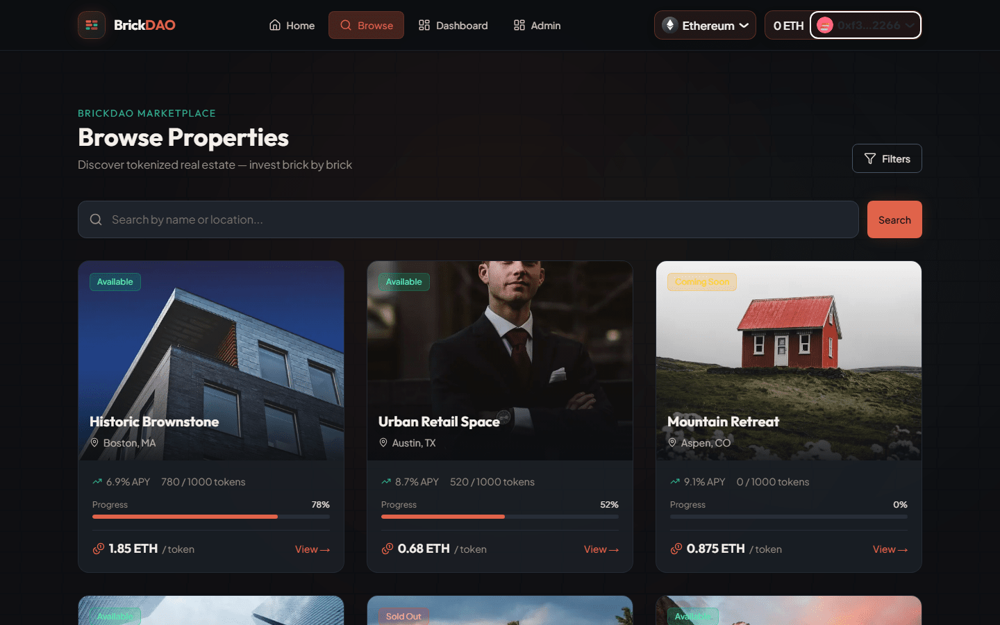
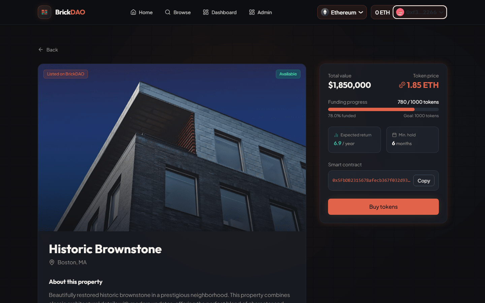
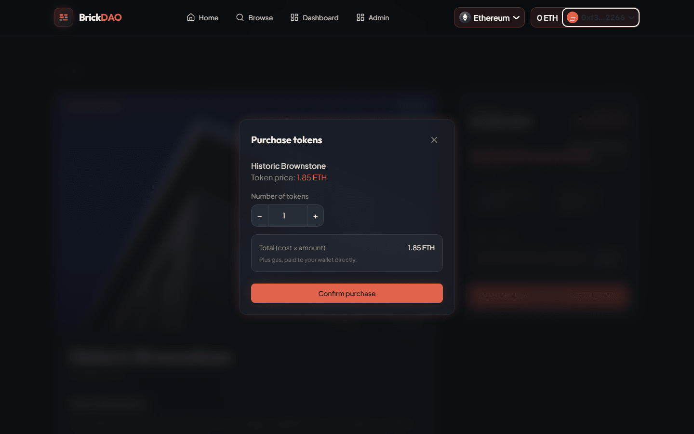
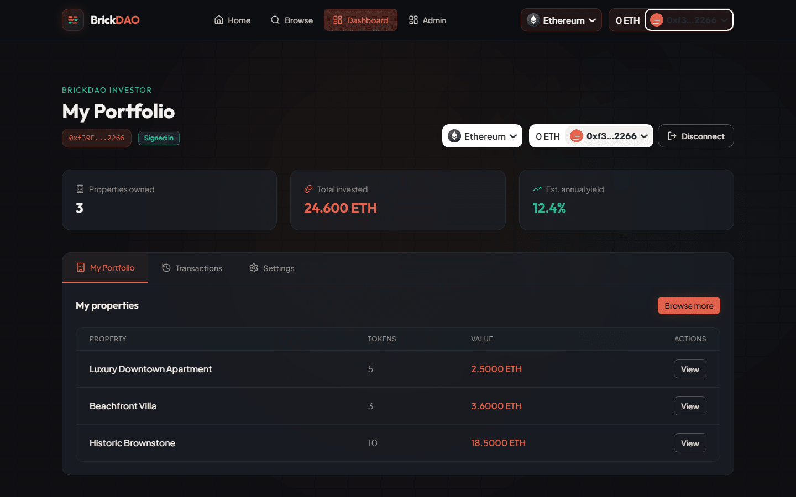

# BrickDAO Frontend

Next.js web app for BrickDAO, a tokenized real estate platform. Investors connect a wallet, sign in, browse properties served by the API, buy ERC-1155 property tokens on-chain, and track their portfolio. Admins manage listings from a protected panel. See the [root README](../README.md) for the full architecture and local setup.

| Browse | Property detail |
| --- | --- |
|  |  |
| **Purchase** | **Dashboard** |
|  |  |

## Stack

- **Framework:** Next.js 16 (App Router), React 19, TypeScript
- **Wallet:** RainbowKit and wagmi 2 with viem
- **Server state:** TanStack Query 5
- **Auth state:** a React context (`AuthProvider`) on top of wagmi's account state
- **Styling and UI:** Tailwind CSS 4 (design tokens in `src/app/globals.css`), framer-motion, lucide-react
- **Lint:** ESLint 9 with `eslint-config-next`

## Routes

| Route | Page | Notes |
| --- | --- | --- |
| `/` | Home | Landing content after sign-in |
| `/browse` | Browse properties | Search and filters are sent to the API as query parameters |
| `/property/[id]` | Property detail | Funding progress, contract address, "Buy tokens" |
| `/user` | Investor dashboard | Portfolio, transactions and settings tabs |
| `/admin` | Admin panel | Shows "Admin access required" unless the signed-in wallet has the ADMIN role |
| `/about` | About | Static content |

Every route sits behind the gate in `src/components/app-gate.tsx`:

1. No wallet connected shows the connect landing page.
2. Wallet connected but not signed in shows the sign-in screen.
3. Signed in renders the page inside the app shell (navbar, footer).

## Wallet connection and sign-in

`src/lib/wagmi.ts` configures RainbowKit's `getDefaultConfig` with Ethereum mainnet, Polygon, Optimism, Arbitrum and Base, plus Sepolia when `NEXT_PUBLIC_ENABLE_TESTNETS=true`. `src/components/providers.tsx` wraps the app in `WagmiProvider`, `QueryClientProvider`, `RainbowKitProvider` and `AuthProvider`.

Being connected and being signed in are separate steps. `AuthProvider` (`src/contexts/auth-context.tsx`) handles the second one:

1. `signIn()` asks the API for a message with `POST /auth/nonce`.
2. The wallet signs it with `useSignMessage` (no gas, no transaction).
3. The signature goes to `POST /auth/verify`, which returns the access and refresh tokens and the user (`id`, `address`, `role`).
4. Tokens are kept in `src/lib/token-store.ts`: the access token in memory and `sessionStorage`, the refresh token in `localStorage`. On load the provider restores the session from the refresh token.
5. If the wallet disconnects or switches to a different address, the session is dropped. `logout()` revokes the refresh token on the API, clears the tokens and disconnects the wallet.

The API client in `src/lib/api.ts` attaches the access token to each request and, on a 401, tries `POST /auth/refresh` once and retries the request.

## How a purchase works

`src/components/modals/transaction-modal.tsx` is opened from the property page.

1. The modal reads the property's `tokenId` and `contractAddress` (falling back to `NEXT_PUBLIC_ASSET_FACTORY_ADDRESS`). If either is missing it shows "Not tokenized yet" and does nothing else.
2. On confirm it calls `AssetFactory.buy(tokenId, buyer, amount, "0x")` through wagmi's `useWriteContract`, sending `tokenPrice × amount` as the transaction value. The ABI is in `src/lib/contracts/asset-factory-abi.ts`.
3. `useWaitForTransactionReceipt` watches the transaction. States shown: confirm in wallet, processing, complete, failed.
4. Once the receipt succeeds, the app calls `POST /finance/transactions` with the property, token amount, value and transaction hash, then invalidates the `portfolio`, `transactions` and `property` queries so the dashboard updates.

The contract only accepts a purchase if the buyer is whitelisted for that token and `msg.value` equals the contract's `cost × amount`; see the [contracts README](../contracts/README.md).

## State management

- **Server data** lives in TanStack Query (`src/lib/queries.ts`): `useProperties(query)`, `useProperty(id)`, `usePortfolio()`, `useTransactions(type)`. Mutations that change server data invalidate the matching query keys.
- **Auth** lives in `AuthProvider`: `isConnected`, `isAuthenticated`, `isAdmin`, `user`, `signIn`, `logout`, `signInError`. Components read it with `useAuth()`.
- **On-chain state** (account, chain, transaction status) comes from wagmi hooks.
- There is no global client-side store beyond these.

## Project structure

```
src/
  app/            Routes: page.tsx, browse/, property/[id]/, user/, admin/, about/
  components/     app-gate, connect-landing, sign-in-screen, providers
    layout/       navbar, footer, page-shell
    modals/       transaction-modal, property-form-modal
    ui/           button, badge, logo, property-card, brand-icons
  contexts/       auth-context
  lib/            api client, token store, wagmi config, query hooks
    contracts/    AssetFactory ABI and address config
  stubs/          local stand-in for an optional dependency (see next.config.ts)
  types/          property types
```

## Setup

Prerequisites: Node.js 20+ and a running [backend](../backend/README.md).

```bash
npm install
cp .env.example .env.local    # then edit the values
npm run dev                   # http://localhost:3000
```

The development server uses Turbopack. For a production build:

```bash
npm run build
npm run start
```

## Scripts

| Command | What it does |
| --- | --- |
| `npm run dev` | Development server on port 3000 |
| `npm run build` | Production build |
| `npm run start` | Serve the production build |
| `npm run lint` | ESLint |

## Environment variables

Read at build time, so restart the dev server (or rebuild) after changing them. Copy `.env.example` to `.env.local`.

| Variable | Description |
| --- | --- |
| `NEXT_PUBLIC_API_URL` | Base URL of the backend, e.g. `http://localhost:4000` |
| `NEXT_PUBLIC_WALLETCONNECT_PROJECT_ID` | WalletConnect project id for RainbowKit (free at https://cloud.walletconnect.com) |
| `NEXT_PUBLIC_ENABLE_TESTNETS` | `true` adds Sepolia to the selectable chains |
| `NEXT_PUBLIC_ASSET_FACTORY_ADDRESS` | Deployed `AssetFactory` address; a property's own `contractAddress` takes precedence |

## Notes

- `next.config.ts` aliases a few optional `@x402/*` packages, pulled in transitively by RainbowKit's default wallet list, to `src/stubs/x402-optional-dep-stub.ts`. Turbopack resolves dynamic imports at build time and would otherwise fail on the missing packages. The app makes no x402 payments.
- A wallet on a chain that is not in `src/lib/wagmi.ts` (for example a local Hardhat node on chain id 31337) shows "Wrong network" in RainbowKit.
